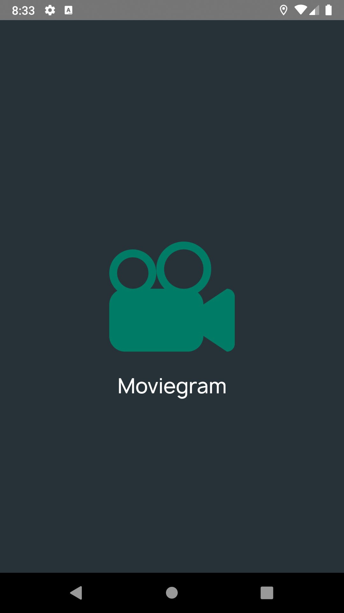
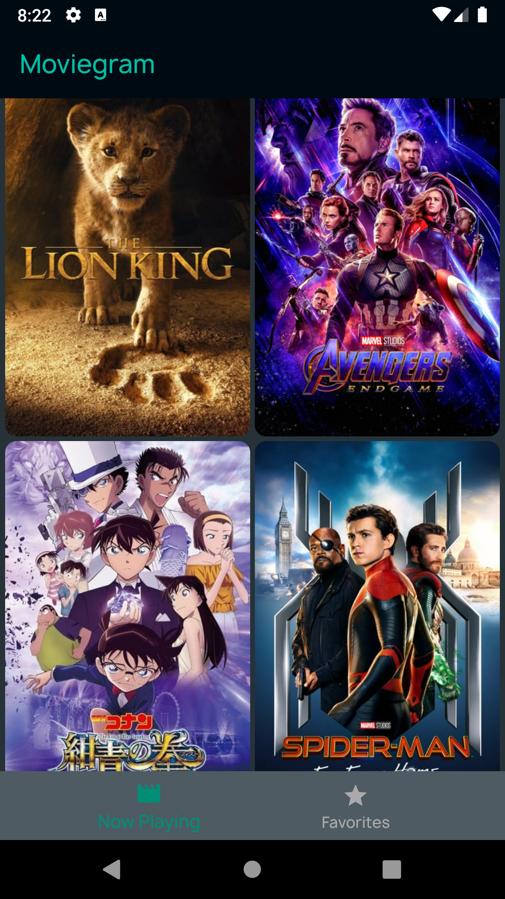
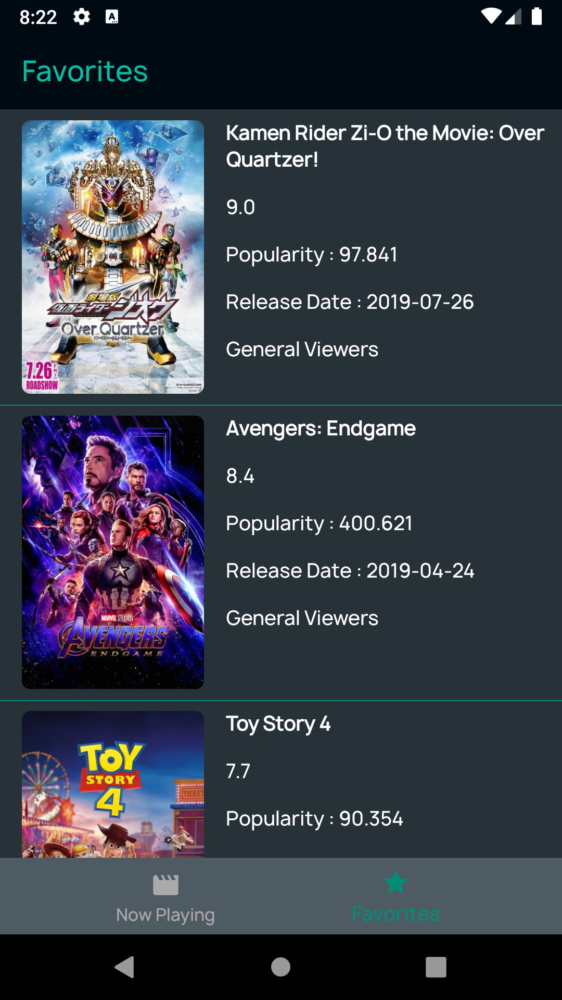
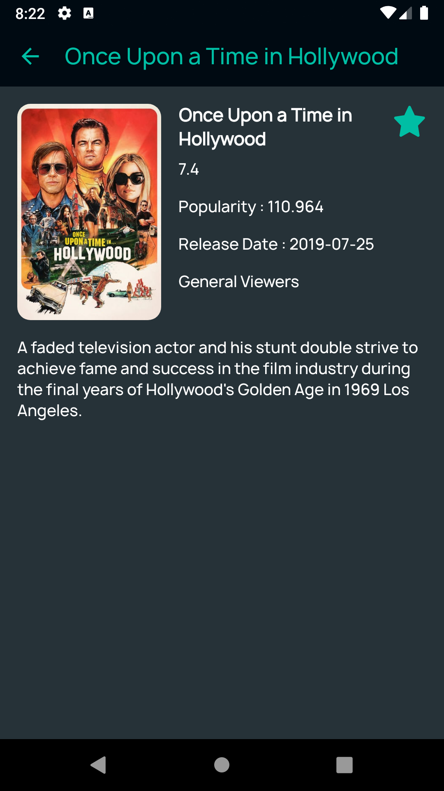

# Moviegram
This is my internship project to improve my programmming skills and learn much detail about some Android concepts 
such as Retrofit, Room, MVVM architecture.

   

# Libraries
- [Android Architecture Components](https://developer.android.com/topic/libraries/data-binding/)

- [Retrofit](https://square.github.io/retrofit/)

- [Room](https://developer.android.com/jetpack/androidx/releases/room/)

- [Glide](https://github.com/bumptech/glide/)

- [Lottie](https://github.com/airbnb/lottie-android/)

- [Reactive Network](https://github.com/pwittchen/ReactiveNetwork)

- [Stetho](http://facebook.github.io/stetho/)

- [Styleable Toast](https://github.com/Muddz/StyleableToast)

- [Logging Interceptor](https://github.com/square/okhttp/tree/master/okhttp-logging-interceptor)

# Structure 

Moviegram written by Kotlin Language and uses MVVM architecture.

## Submission

### - Explain the project in general and how to run it.

Moviegram uses [TheMovieDB Api](https://www.themoviedb.org/documentation/api). It shows you the now playing movies in three different screens.
There are Now Playing and Favorites sections bottom on the main screen. The other step is when you click on a movie, it takes the selected movie id 
and gets the detail of that movie. Moreover, when you click favorite button on movie detail screen, it saves the movie to favorites list 
and you can see them in favorites screen. Therefore, movies, you like or want to watch, is showed on favorites screen and you can easily modify it.

### - Why you have selected that software architecture?

Moviegram uses the Android MVVM architecture. In order to support both orientation of this project, prevent possible memory leaks
or weird behaviors, the lifecycle awareness is very needed. The ViewModel component takes care of that responsibility via 
its lifecycle owner(Activities or Fragments).

### - What would you change if you had more time?

If I had more time to research and implement, I would like to use some libraries to my project such as
- [Dagger2](https://dagger.dev/)

- [Rxjava](https://github.com/ReactiveX/RxJava)

- Coroutine

- [Data Binding](https://developer.android.com/topic/libraries/data-binding/)

- [Paging Library](https://developer.android.com/topic/libraries/architecture/paging/)

### - What to do to make app production ready? 

- Should write unit and UI tests of the project before publishing
- Should use Proguard in order to minify, obfuscate, and optimize the code.

